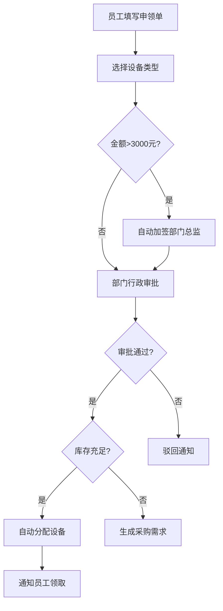
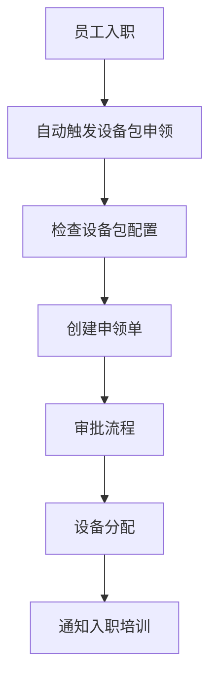
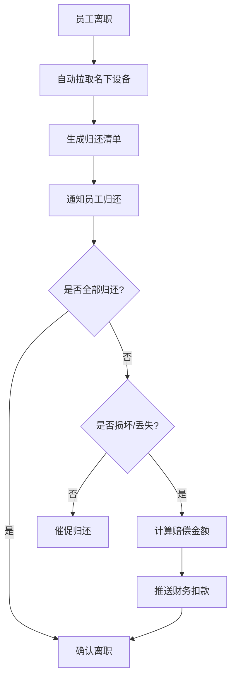
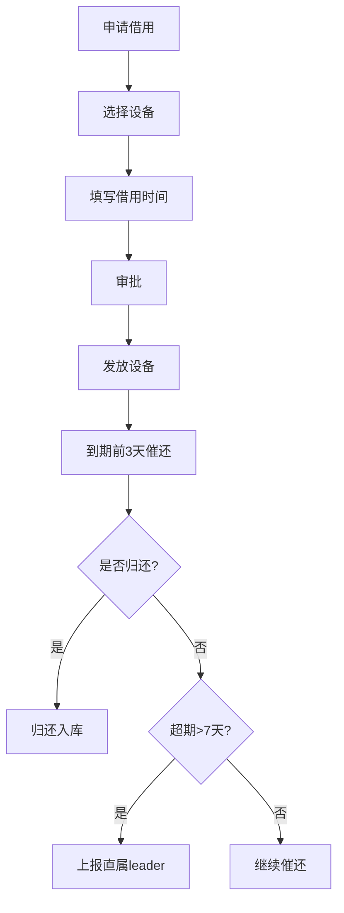
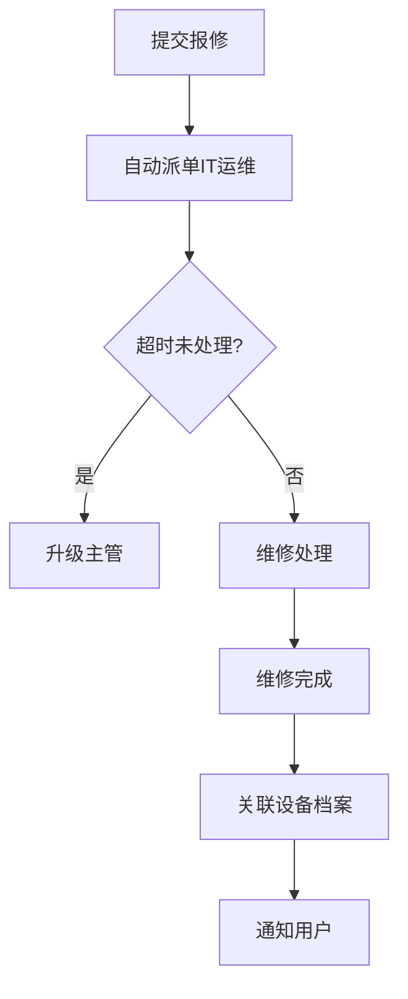
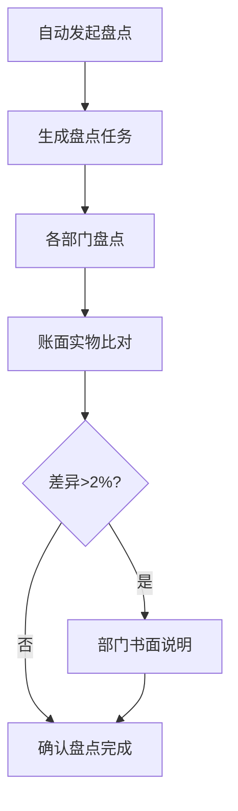

## 1. Product Overview
公司内部IT设备申领与资产全生命周期管理平台，实现从设备采购、分配、使用、维护到报废的完整生命周期管理，同时涵盖审批流程、库存管理、借用归还、报修派单、盘点报表等核心业务功能。

- 主要目的：规范化IT设备管理流程，提高资产管理效率，降低运营成本
- 目标用户：企业员工、部门行政、IT运维人员、主管领导、财务人员、系统管理员
- 市场价值：实现资产全生命周期可视化，自动化审批与流程流转，减少人工干预

## 2. Core Features

### 2.1 User Roles
| Role | Registration Method | Core Permissions |
|------|---------------------|------------------|
| 普通员工 | 内部账号 | 申领设备、报修、查看自己名下设备 |
| 部门行政 | 管理员配置 | 查看本部门设备、审批本部门申领 |
| IT运维 | 管理员配置 | 设备入库、分配、维修、盘点操作 |
| 主管/财务 | 管理员配置 | 查看全公司报表、审批大额申请、查看财务数据 |
| 系统管理员 | 管理员配置 | 全局规则配置、用户管理、权限设置 |

### 2.2 Feature Modules
1. **仪表盘首页**：设备总数、部门分布、故障率排行、待审批数
2. **设备申领**：填写申领单、选择设备类型、自动加签审批
3. **库存管理**：设备入库、库存查询、自动分配、采购需求
4. **借用管理**：设备借用申请、到期提醒、超期上报
5. **报修管理**：报修申请、自动派单、超时升级、维修记录
6. **资产盘点**：季度盘点发起、账面实物比对、差异处理
7. **设备档案**：独立档案页、全生命周期记录
8. **报表中心**：组合查询、Excel导出、月度报表
9. **系统设置**：权限配置、审批规则、通知设置、日志管理

### 2.3 Page Details
| Page Name | Module Name | Feature description |
|-----------|-------------|---------------------|
| 仪表盘首页 | 概览卡片 | 展示设备总数、在线率、故障率等核心指标 |
| 仪表盘首页 | 部门分布 | 饼图展示设备按部门分布情况 |
| 仪表盘首页 | 故障率排行 | 柱状图展示各部门故障率排行 |
| 仪表盘首页 | 待办事项 | 待审批数量、待处理报修等待办统计 |
| 设备申领 | 申领表单 | 选择设备类型、填写用途、自动计算金额 |
| 设备申领 | 审批流程 | 超过3000元自动加签部门总监 |
| 设备申领 | 申领记录 | 查看历史申领单状态 |
| 库存管理 | 库存列表 | 设备库存查询、入库操作 |
| 库存管理 | 自动分配 | 审批通过后自动匹配库存分配 |
| 库存管理 | 采购需求 | 库存不足时生成采购需求单 |
| 借用管理 | 借用申请 | 选择设备、填写借用时间 |
| 借用管理 | 催还提醒 | 到期前3天自动提醒 |
| 借用管理 | 超期处理 | 超7天未还自动上报直属leader |
| 报修管理 | 报修表单 | 填写故障描述、上传图片 |
| 报修管理 | 派单处理 | 自动派单IT运维人员 |
| 报修管理 | 超时升级 | 超时未处理自动升级主管 |
| 资产盘点 | 盘点发起 | 每季度自动发起盘点任务 |
| 资产盘点 | 实物比对 | 账面与实物数量比对 |
| 资产盘点 | 差异处理 | 差异超2%需部门书面说明 |
| 设备档案 | 档案详情 | 记录采购、分配、维修、报废全生命周期 |
| 报表中心 | 组合查询 | 按部门、员工、设备类型筛选 |
| 报表中心 | Excel导出 | 查询结果导出Excel文件 |
| 报表中心 | 月度报表 | 自动生成资产统计报表 |
| 系统设置 | 权限管理 | 四级权限配置 |
| 系统设置 | 规则配置 | 审批金额阈值、催还天数等 |
| 系统设置 | 日志管理 | 关键操作留痕 |

## 3. Core Processes

### 3.1 设备申领流程

### 3.2 入职设备包流程

### 3.3 离职归还流程

### 3.4 设备借用流程

### 3.5 报修流程

### 3.6 季度盘点流程

## 4. User Interface Design

### 4.1 Design Style
- **主色调**：深蓝色 (#1e3a5f) 搭配科技感蓝色 (#3b82f6)
- **辅助色**：绿色 (#22c55e) 用于成功状态，橙色 (#f97316) 用于警告，红色 (#ef4444) 用于错误
- **按钮风格**：圆角矩形，hover状态有轻微上浮效果和阴影
- **字体**：Inter作为主字体，清晰易读
- **布局**：左侧导航栏 + 右侧内容区，卡片式布局
- **图标**：Lucide React图标库，简洁现代

### 4.2 Page Design Overview
| Page Name | Module Name | UI Elements |
|-----------|-------------|-------------|
| 仪表盘首页 | 概览卡片 | 四个统计卡片横向排列，数字醒目，带趋势指示 |
| 仪表盘首页 | 图表区域 | 部门分布饼图 + 故障率排行柱状图，响应式布局 |
| 仪表盘首页 | 待办列表 | 垂直列表展示待审批、待处理事项 |
| 设备申领 | 申领表单 | 表单分步骤填写，带金额实时计算 |
| 设备申领 | 流程追踪 | 审批流程进度条可视化 |
| 库存管理 | 库存表格 | 分页表格展示库存，支持搜索筛选 |
| 借用管理 | 借用列表 | 卡片式展示借用状态，颜色区分到期情况 |
| 报修管理 | 报修工单 | 工单列表，状态标签颜色区分 |
| 设备档案 | 档案时间线 | 垂直时间线展示设备生命周期各阶段 |
| 报表中心 | 查询表单 | 多条件组合查询，日期范围选择 |

### 4.3 Responsiveness
- **桌面端**：完整功能展示，左侧导航栏固定
- **平板端**：导航栏收缩为图标，内容区自适应
- **移动端**：底部导航栏，内容区滚动展示

### 4.4 Accessibility
- 支持键盘导航
- 按钮和链接有清晰的focus状态
- 图表配有文字说明
- 颜色对比度符合WCAG标准
