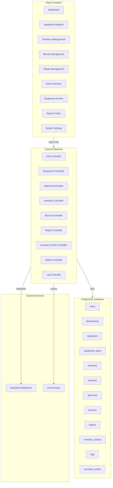
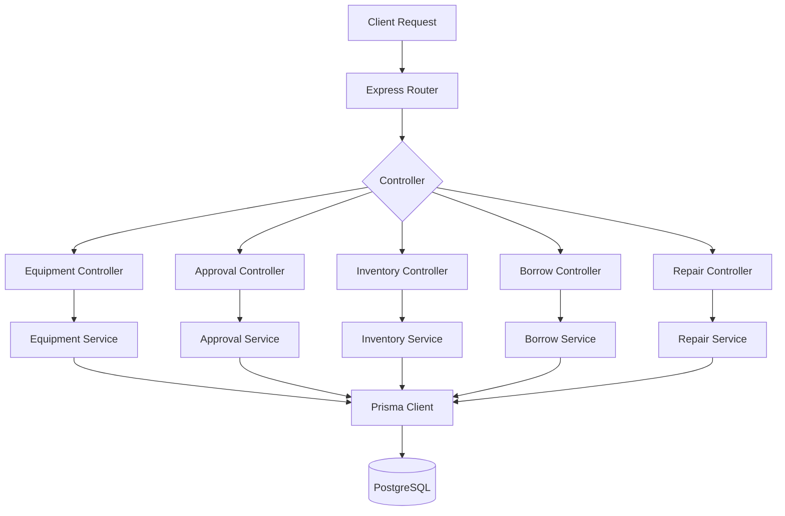
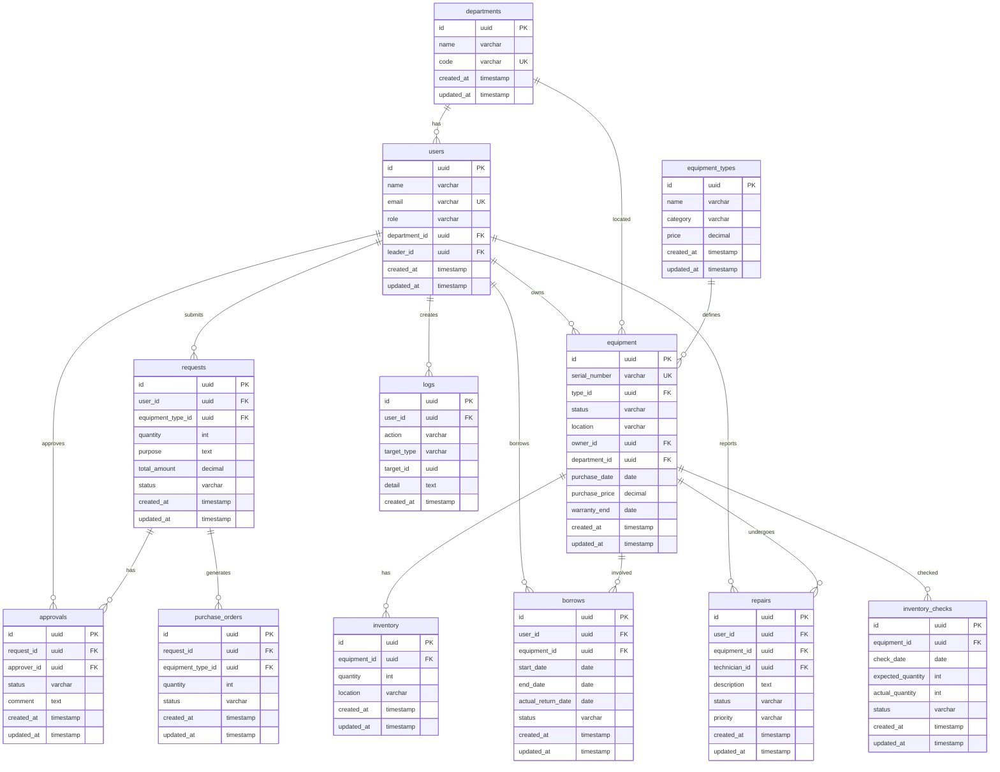

## 1. Architecture Design



## 2. Technology Description

- **Frontend**: React@18 + TypeScript + TailwindCSS@3 + Vite
- **State Management**: Zustand
- **Routing**: React Router DOM v6
- **Icons**: Lucide React
- **Charts**: Recharts
- **Excel Export**: xlsx
- **Backend**: Express@4 + TypeScript
- **Database**: PostgreSQL (Supabase)
- **Authentication**: Supabase Auth
- **ORM**: Prisma
- **Validation**: Zod
- **Notifications**: DingTalk Webhook

## 3. Route Definitions

| Route | Purpose | Required Role |
|-------|---------|---------------|
| / | Dashboard homepage | All |
| /login | Login page | None |
| /requests | Equipment request list | All |
| /requests/new | Create new request | Employee+ |
| /requests/:id | Request detail | Employee+ |
| /inventory | Inventory management | IT+ |
| /inventory/new | Add new equipment | IT+ |
| /borrows | Borrow management | IT+ |
| /borrows/new | Create borrow request | Employee+ |
| /repairs | Repair management | IT+ |
| /repairs/new | Create repair request | Employee+ |
| /inventory-check | Asset inventory | Admin+ |
| /equipment/:id | Equipment archive | Admin+ |
| /reports | Report center | Admin+ |
| /settings | System settings | Admin |
| /logs | Operation logs | Admin |

## 4. API Definitions

### 4.1 Authentication APIs

| Method | Endpoint | Description |
|--------|----------|-------------|
| POST | /api/auth/login | User login |
| POST | /api/auth/logout | User logout |
| GET | /api/auth/me | Get current user |

### 4.2 Equipment APIs

| Method | Endpoint | Description |
|--------|----------|-------------|
| GET | /api/equipment | Get equipment list |
| GET | /api/equipment/:id | Get equipment detail |
| POST | /api/equipment | Create equipment |
| PUT | /api/equipment/:id | Update equipment |
| DELETE | /api/equipment/:id | Delete equipment |

### 4.3 Request APIs

| Method | Endpoint | Description |
|--------|----------|-------------|
| GET | /api/requests | Get request list |
| GET | /api/requests/:id | Get request detail |
| POST | /api/requests | Create request |
| PUT | /api/requests/:id/approve | Approve request |
| PUT | /api/requests/:id/reject | Reject request |

### 4.4 Inventory APIs

| Method | Endpoint | Description |
|--------|----------|-------------|
| GET | /api/inventory | Get inventory list |
| POST | /api/inventory | Add inventory |
| PUT | /api/inventory/:id | Update inventory |
| DELETE | /api/inventory/:id | Remove inventory |

### 4.5 Borrow APIs

| Method | Endpoint | Description |
|--------|----------|-------------|
| GET | /api/borrows | Get borrow list |
| POST | /api/borrows | Create borrow |
| PUT | /api/borrows/:id/return | Return borrowed equipment |

### 4.6 Repair APIs

| Method | Endpoint | Description |
|--------|----------|-------------|
| GET | /api/repairs | Get repair list |
| POST | /api/repairs | Create repair |
| PUT | /api/repairs/:id/assign | Assign repair |
| PUT | /api/repairs/:id/complete | Complete repair |

### 4.7 Report APIs

| Method | Endpoint | Description |
|--------|----------|-------------|
| GET | /api/reports/dashboard | Get dashboard stats |
| GET | /api/reports/export | Export to Excel |
| GET | /api/reports/monthly | Get monthly report |

## 5. Server Architecture Diagram



## 6. Data Model

### 6.1 Data Model Definition



### 6.2 Data Definition Language

```sql
CREATE TABLE departments (
    id UUID PRIMARY KEY DEFAULT gen_random_uuid(),
    name VARCHAR(100) NOT NULL,
    code VARCHAR(20) UNIQUE NOT NULL,
    created_at TIMESTAMP DEFAULT CURRENT_TIMESTAMP,
    updated_at TIMESTAMP DEFAULT CURRENT_TIMESTAMP
);

CREATE TABLE users (
    id UUID PRIMARY KEY DEFAULT gen_random_uuid(),
    name VARCHAR(100) NOT NULL,
    email VARCHAR(255) UNIQUE NOT NULL,
    role VARCHAR(20) NOT NULL,
    department_id UUID REFERENCES departments(id),
    leader_id UUID REFERENCES users(id),
    created_at TIMESTAMP DEFAULT CURRENT_TIMESTAMP,
    updated_at TIMESTAMP DEFAULT CURRENT_TIMESTAMP
);

CREATE TABLE equipment_types (
    id UUID PRIMARY KEY DEFAULT gen_random_uuid(),
    name VARCHAR(100) NOT NULL,
    category VARCHAR(50),
    price DECIMAL(12, 2) NOT NULL,
    created_at TIMESTAMP DEFAULT CURRENT_TIMESTAMP,
    updated_at TIMESTAMP DEFAULT CURRENT_TIMESTAMP
);

CREATE TABLE equipment (
    id UUID PRIMARY KEY DEFAULT gen_random_uuid(),
    serial_number VARCHAR(50) UNIQUE NOT NULL,
    type_id UUID REFERENCES equipment_types(id),
    status VARCHAR(20) NOT NULL,
    location VARCHAR(100),
    owner_id UUID REFERENCES users(id),
    department_id UUID REFERENCES departments(id),
    purchase_date DATE,
    purchase_price DECIMAL(12, 2),
    warranty_end DATE,
    created_at TIMESTAMP DEFAULT CURRENT_TIMESTAMP,
    updated_at TIMESTAMP DEFAULT CURRENT_TIMESTAMP
);

CREATE TABLE inventory (
    id UUID PRIMARY KEY DEFAULT gen_random_uuid(),
    equipment_id UUID REFERENCES equipment(id),
    quantity INT NOT NULL DEFAULT 0,
    location VARCHAR(100),
    created_at TIMESTAMP DEFAULT CURRENT_TIMESTAMP,
    updated_at TIMESTAMP DEFAULT CURRENT_TIMESTAMP
);

CREATE TABLE requests (
    id UUID PRIMARY KEY DEFAULT gen_random_uuid(),
    user_id UUID REFERENCES users(id),
    equipment_type_id UUID REFERENCES equipment_types(id),
    quantity INT NOT NULL DEFAULT 1,
    purpose TEXT,
    total_amount DECIMAL(12, 2),
    status VARCHAR(20) NOT NULL DEFAULT 'pending',
    created_at TIMESTAMP DEFAULT CURRENT_TIMESTAMP,
    updated_at TIMESTAMP DEFAULT CURRENT_TIMESTAMP
);

CREATE TABLE approvals (
    id UUID PRIMARY KEY DEFAULT gen_random_uuid(),
    request_id UUID REFERENCES requests(id),
    approver_id UUID REFERENCES users(id),
    status VARCHAR(20) NOT NULL,
    comment TEXT,
    created_at TIMESTAMP DEFAULT CURRENT_TIMESTAMP,
    updated_at TIMESTAMP DEFAULT CURRENT_TIMESTAMP
);

CREATE TABLE borrows (
    id UUID PRIMARY KEY DEFAULT gen_random_uuid(),
    user_id UUID REFERENCES users(id),
    equipment_id UUID REFERENCES equipment(id),
    start_date DATE NOT NULL,
    end_date DATE NOT NULL,
    actual_return_date DATE,
    status VARCHAR(20) NOT NULL DEFAULT 'active',
    created_at TIMESTAMP DEFAULT CURRENT_TIMESTAMP,
    updated_at TIMESTAMP DEFAULT CURRENT_TIMESTAMP
);

CREATE TABLE repairs (
    id UUID PRIMARY KEY DEFAULT gen_random_uuid(),
    user_id UUID REFERENCES users(id),
    equipment_id UUID REFERENCES equipment(id),
    technician_id UUID REFERENCES users(id),
    description TEXT NOT NULL,
    status VARCHAR(20) NOT NULL DEFAULT 'pending',
    priority VARCHAR(20) DEFAULT 'normal',
    created_at TIMESTAMP DEFAULT CURRENT_TIMESTAMP,
    updated_at TIMESTAMP DEFAULT CURRENT_TIMESTAMP
);

CREATE TABLE inventory_checks (
    id UUID PRIMARY KEY DEFAULT gen_random_uuid(),
    equipment_id UUID REFERENCES equipment(id),
    check_date DATE NOT NULL,
    expected_quantity INT NOT NULL,
    actual_quantity INT NOT NULL,
    status VARCHAR(20) NOT NULL DEFAULT 'pending',
    created_at TIMESTAMP DEFAULT CURRENT_TIMESTAMP,
    updated_at TIMESTAMP DEFAULT CURRENT_TIMESTAMP
);

CREATE TABLE purchase_orders (
    id UUID PRIMARY KEY DEFAULT gen_random_uuid(),
    request_id UUID REFERENCES requests(id),
    equipment_type_id UUID REFERENCES equipment_types(id),
    quantity INT NOT NULL,
    status VARCHAR(20) NOT NULL DEFAULT 'pending',
    created_at TIMESTAMP DEFAULT CURRENT_TIMESTAMP,
    updated_at TIMESTAMP DEFAULT CURRENT_TIMESTAMP
);

CREATE TABLE logs (
    id UUID PRIMARY KEY DEFAULT gen_random_uuid(),
    user_id UUID REFERENCES users(id),
    action VARCHAR(50) NOT NULL,
    target_type VARCHAR(50),
    target_id UUID,
    detail TEXT,
    created_at TIMESTAMP DEFAULT CURRENT_TIMESTAMP
);

CREATE INDEX idx_users_department_id ON users(department_id);
CREATE INDEX idx_users_leader_id ON users(leader_id);
CREATE INDEX idx_equipment_type_id ON equipment(type_id);
CREATE INDEX idx_equipment_owner_id ON equipment(owner_id);
CREATE INDEX idx_requests_user_id ON requests(user_id);
CREATE INDEX idx_requests_status ON requests(status);
CREATE INDEX idx_borrows_user_id ON borrows(user_id);
CREATE INDEX idx_borrows_status ON borrows(status);
CREATE INDEX idx_borrows_end_date ON borrows(end_date);
CREATE INDEX idx_repairs_status ON repairs(status);
CREATE INDEX idx_logs_user_id ON logs(user_id);
CREATE INDEX idx_logs_created_at ON logs(created_at);
```

## 7. Permission Rules

| Role | Permission Level | Allowed Actions |
|------|------------------|-----------------|
| employee | Level 1 | View own equipment, submit requests, submit repairs, submit borrows |
| department_admin | Level 2 | View department equipment, approve department requests |
| it_staff | Level 3 | Manage inventory, assign equipment, process repairs, conduct inventory checks |
| admin | Level 4 | Full system access, manage users, configure rules, view all reports, manage logs |

## 8. Business Rules Configuration

| Rule Name | Default Value | Description |
|-----------|---------------|-------------|
| approval_threshold | 3000 | Amount threshold requiring director approval |
| borrow_reminder_days | 3 | Days before end date to send reminder |
| borrow_overdue_days | 7 | Days after end date to escalate to leader |
| repair_timeout_hours | 24 | Hours before repair request escalates |
| inventory_diff_threshold | 2 | Percentage threshold requiring explanation |
